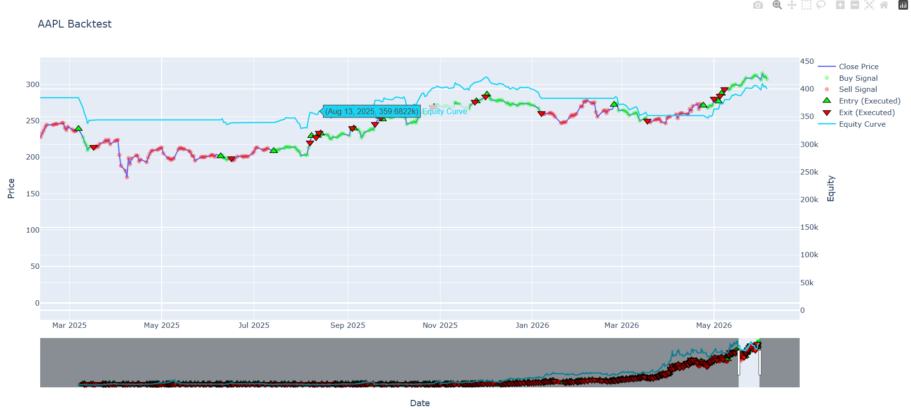

# ib-data-pipeline

A Python-based trading research system for ingesting Interactive Brokers historical data, storing it in DuckDB, generating indicators, and running event-driven strategy backtests with visualisation tools.

---

## Features

- Interactive Brokers historical data ingestion
- Local storage using DuckDB
- Multi-timeframe data support (intraday + daily) via configurable IB settings
- Modular indicator system (SMA, RSI, Bollinger Bands, etc.)
- Strategy signal generation framework
- Event-driven backtesting engine
- Trade tracking (entries/exits, PnL)
- Interactive Plotly visualisation of:
  - Price action
  - Buy/sell signals
  - Executed trades
  - Equity curve

---

## Architecture

The system is structured into modular components:

- data_access → Loads historical market data from DuckDB
- data_ingestion → Handles IB contract ingestion
- features → Technical indicators (SMA, RSI, Bollinger Bands)
- strategies → Signal generation logic
- research → Backtesting engine
- visualisation → Plotting and analysis tools

---

## Workflow

1. Load historical market data from DuckDB
2. Generate technical indicators
3. Create buy/sell signals from strategy rules
4. Run event-driven backtest
5. Track positions, equity, and trades
6. Visualise results interactively

---

## Configuration

The system is centralised through a `config.py` file which controls:

- Interactive Brokers connection settings (host, port, client ID)
- Data request parameters (bar size, duration, RTH settings)
- Supported timeframes (1min → 1day)
- Request batching limits for IB API
- Project directory paths

---

## Example Usage

```python
from ib_insync import Stock
from data_access.loader import load_data
from research.backtesting_function import run_backtest
from visualisation.backtest_plot import plot_backtest

contract = Stock("AAPL", "SMART", "USD")

df = load_data(contract, timeframe="1day")
df, trades = run_backtest(df)

plot_backtest(df, trades)
```
---
## Example Output
- Backtest produces:
  - Equity curve
  - Entry/exit points
  - Trade list with PnL
### AAPL Strategy Backtest Result



- Green markers → executed entries  
- Red markers → executed exits  
- Blue line → price action  


